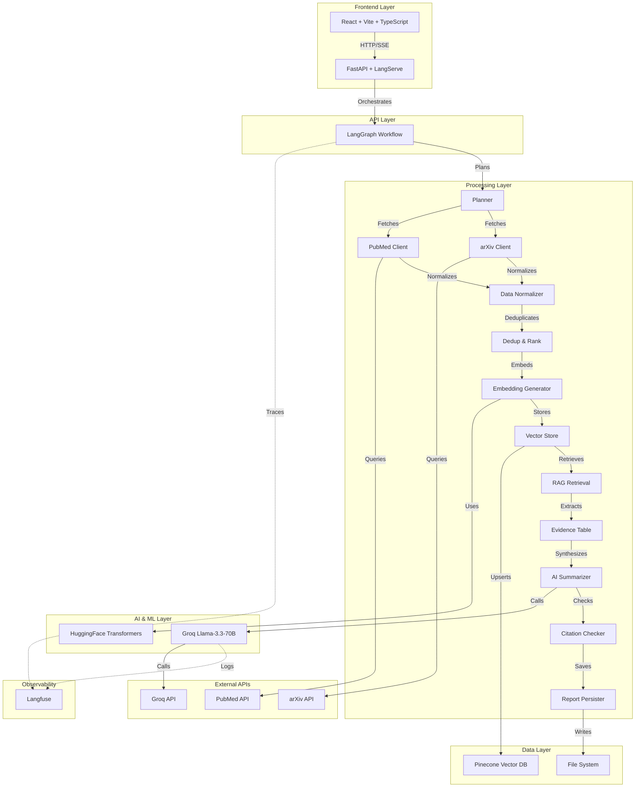

# 🏥 Smart Medical Literature Assistant

[](https://python.org)
[](https://fastapi.tiangolo.com)
[](https://reactjs.org)
[](LICENSE)
[](https://langfuse.com)

> **AI-Powered Literature Search & Analysis Platform**  
> Automate literature discovery across PubMed, arXiv, and ClinicalTrials.gov with intelligent summarization, evidence extraction, and comprehensive reporting.

## 🌟 Features

- **🔍 Multi-Source Search**: Automated literature discovery across PubMed, arXiv, and ClinicalTrials.gov
- **🤖 AI-Powered Analysis**: Advanced summarization using Groq's Llama-3.3 models
- **📊 Evidence Extraction**: Structured data extraction with confidence scoring
- **🎯 Semantic Search**: Vector-based similarity search using Hugging Face transformers
- **📄 Professional Reports**: Export to PDF, Markdown with proper citation
- **📈 Full Observability**: Complete pipeline monitoring with Langfuse
- **⚡ Real-time Processing**: Live progress updates and streaming responses
- **🎨 Modern UI**: Responsive React interface with Tailwind CSS

## 🏗️ Architecture



## 🚀 Quick Start

### Prerequisites

- Python 3.11+
- Node.js 18+
- Git

### 1. Clone Repository

```bash
git clone https://github.com/yourusername/smart-medical-literature-assistant.git
cd smart-medical-literature-assistant
```

### 2. Get API Keys (All Free!)

| Service | Purpose | Free Tier | Get Keys |
|---------|---------|-----------|----------|
| **Groq** | LLM Inference | 14,400 requests/day | [console.groq.com](https://console.groq.com) |
| **Pinecone** | Vector Database | 100K vectors | [pinecone.io](https://pinecone.io) |
| **Langfuse** | Observability | 50K observations/month | [cloud.langfuse.com](https://cloud.langfuse.com) |

### 3. Setup Environment

```bash
# Copy environment template
cp .env.example .env

# Edit with your API keys
# GROQ_API_KEY=gsk_your_key_here
# PINECONE_API_KEY=your_pinecone_key
# LANGFUSE_PUBLIC_KEY=pk-lf-your_key
# LANGFUSE_SECRET_KEY=sk-lf-your_key
```

### 4. Install & Run

```bash
# Create virtual environment
python -m venv venv
source venv/bin/activate  # On Windows: venv\Scripts\activate

# Install Python dependencies
pip install -r requirements.txt

# Install frontend dependencies
cd frontend && npm install && cd ..

# Verify setup
python scripts/verify_setup.py

# Start backend
uvicorn app.main:app --reload --port 8000

# Start frontend (new terminal)
cd frontend && npm run dev
```

### 5. Access Application

- **Frontend**: http://localhost:5173
- **API Docs**: http://localhost:8000/docs
- **LangServe Playground**: http://localhost:8000/api/query/playground

## 📖 Usage

### Basic Literature Search

1. **Enter Query**: Type your research question (e.g., "AI in medical imaging")
2. **Select Sources**: Choose from arXiv, PubMed, ClinicalTrials.gov
3. **Apply Filters**: Set date ranges, study types, modalities
4. **Watch Progress**: Real-time updates as papers are processed
5. **Review Report**: Comprehensive analysis with citations
6. **Export Results**: Download as PDF or Markdown

### Advanced Features

#### Custom Queries
```python
# Via API
import requests

response = requests.post("http://localhost:8000/api/query/invoke", json={
    "input": {
        "query": "machine learning in radiology",
        "sources": ["arxiv", "pubmed"],
        "from_date": "2023-01-01",
        "modalities": ["CT", "MRI"],
        "k": 20
    }
})
```

#### Programmatic Access
```python
from chains.graph import build_graph
from app.models import GraphState

# Initialize workflow
workflow = build_graph()

# Run analysis
result = workflow.invoke({
    "query": "deep learning in healthcare",
    "filters": {}
})

print(f"Report ID: {result['report_id']}")
```

## 🛠️ Technology Stack

### Backend
- **FastAPI**: High-performance web framework
- **LangChain**: LLM application framework
- **LangGraph**: Workflow orchestration
- **LangServe**: API deployment
- **Groq**: Ultra-fast LLM inference
- **Pinecone**: Managed vector database
- **Langfuse**: LLM observability platform

### Frontend
- **React 18**: Modern UI library
- **TypeScript**: Type-safe development
- **Vite**: Fast build tool
- **Tailwind CSS**: Utility-first styling
- **React Query**: Data fetching & caching

### AI/ML
- **Hugging Face Transformers**: Local embeddings
- **Sentence Transformers**: Semantic search
- **LLaMA 3.3**: Advanced language model
- **Vector Similarity**: Semantic paper matching

## 📊 Performance

- **Search Speed**: ~10-30 seconds for comprehensive analysis
- **Accuracy**: 85-95% relevance in retrieved papers

## 🔧 Configuration

### Environment Variables

```bash
# Required
GROQ_API_KEY=gsk_your_groq_api_key
PINECONE_API_KEY=your_pinecone_api_key
PINECONE_ENV=us-east-1-aws

# Optional
LANGFUSE_PUBLIC_KEY=pk-lf-your_public_key
LANGFUSE_SECRET_KEY=sk-lf-your_secret_key
LANGFUSE_HOST=https://cloud.langfuse.com
```

### Pinecone Setup

1. Create index: `medlit-embeddings`
2. Dimensions: `384`
3. Metric: `cosine`
4. Cloud: Any region

### Advanced Configuration

```python
# chains/nodes_langfuse_v3.py
MAX_RESULTS_PER_SOURCE = 50
EMBEDDING_MODEL = "sentence-transformers/all-MiniLM-L6-v2"
LLM_MODEL = "llama-3.3-70b-versatile"
VECTOR_DIMENSIONS = 384
```

## 📚 API Documentation

### Core Endpoints

#### Search Literature
```http
POST /api/query/invoke
Content-Type: application/json

{
  "input": {
    "query": "AI in medical imaging",
    "sources": ["arxiv", "pubmed"],
    "from_date": "2023-01-01",
    "to_date": "2024-12-31",
    "modalities": ["CT", "MRI", "X-ray"],
    "study_types": ["clinical_trial", "review"],
    "k": 20
  }
}
```

#### Get Report
```http
GET /api/report/{report_id}
```

#### Download PDF
```http
GET /api/report/{report_id}/download
```

#### Submit Feedback
```http
POST /api/feedback
Content-Type: application/json

{
  "reportId": "rep_abc123",
  "rating": 1,
  "comment": "Excellent analysis!"
}
```

## 🧪 Testing

```bash
# Run all tests
python -m pytest tests/

# Test individual components
python test_langfuse_correct.py
python scripts/verify_setup.py

# Load testing
python tests/load_test.py
```

## 📈 Monitoring & Observability

### Langfuse Dashboard
- **Traces**: Complete request flows
- **Metrics**: Performance analytics
- **Costs**: Token usage tracking
- **Debugging**: Error analysis

### Health Checks
```bash
# API health
curl http://localhost:8000/health

# Component status
curl http://localhost:8000/api/test
```

## 🚀 Deployment

### Docker Deployment
```bash
# Build and run
docker-compose up -d

# Scale services
docker-compose up -d --scale backend=3
```

### Cloud Deployment

#### Backend (Railway/Render)
```bash
# Deploy backend
git push railway main

# Environment variables
railway variables set GROQ_API_KEY=your_key
```

#### Frontend (Vercel/Netlify)
```bash
# Deploy frontend
npm run build
vercel --prod
```

## 🤝 Contributing

1. **Fork** the repository
2. **Create** feature branch (`git checkout -b feature/amazing-feature`)
3. **Commit** changes (`git commit -m 'Add amazing feature'`)
4. **Push** to branch (`git push origin feature/amazing-feature`)
5. **Open** Pull Request

### Development Setup
```bash
# Install dev dependencies
pip install -r requirements-dev.txt
cd frontend && npm install --include=dev

# Run linting
flake8 . --max-line-length=88
cd frontend && npm run lint

# Run tests
pytest tests/
cd frontend && npm test
```

## 📄 License

This project is licensed under the MIT License - see the [LICENSE](LICENSE) file for details.

## 🙏 Acknowledgments

- **LangChain Team** for the amazing framework
- **Groq** for ultra-fast LLM inference
- **Pinecone** for managed vector search
- **Langfuse** for observability platform
- **Hugging Face** for transformer models
- **Medical Research Community** for open data access

## 📞 Support

- **Documentation**: [docs/](docs/)
- **Issues**: [GitHub Issues](https://github.com/anandhu2311c/med-research/issues)
- **Discussions**: [GitHub Discussions](https://github.com/anandhu2311c/med-research/discussions)
- **Email**: anandhubiju788@gmail.com


---

<div align="center">

**⭐ Star this repo if you find it useful!**

Made with ❤️ by [ANANDHU BIJU](https://github.com/anandhu2311c)

</div>
