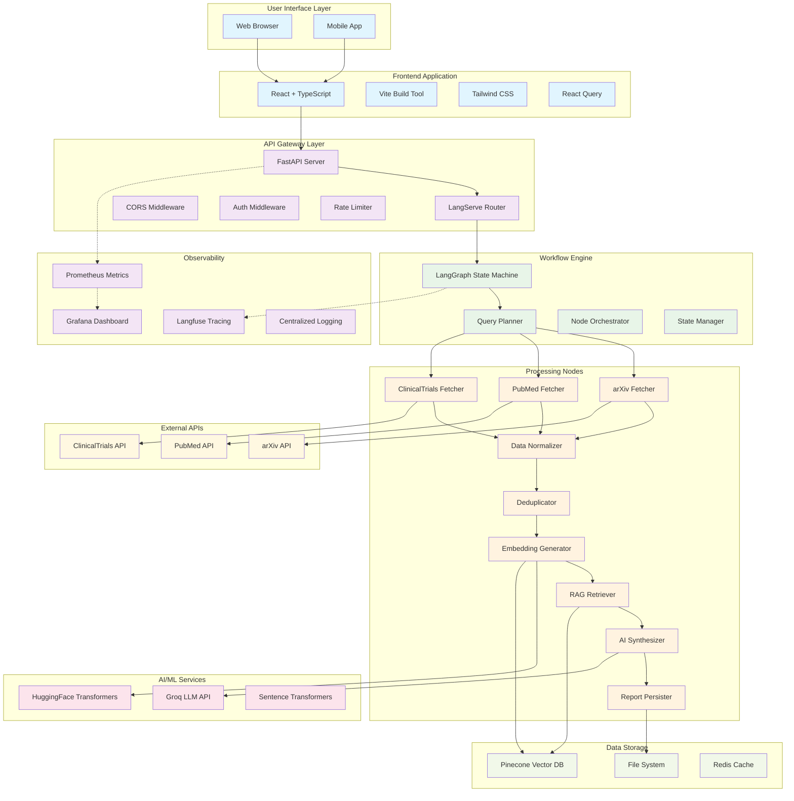
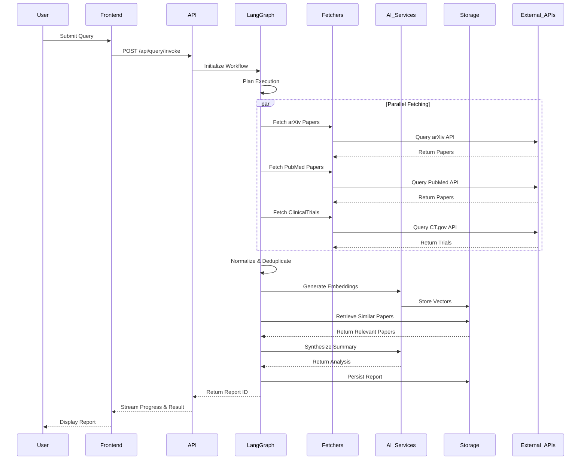
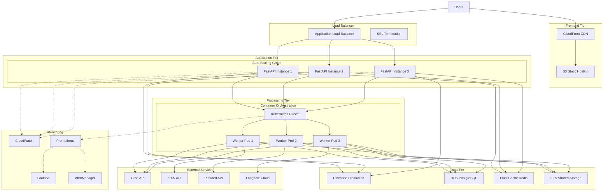
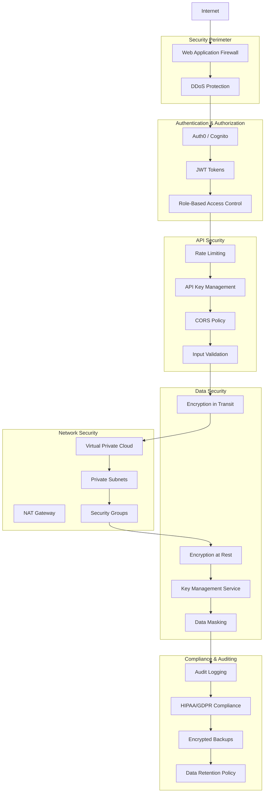
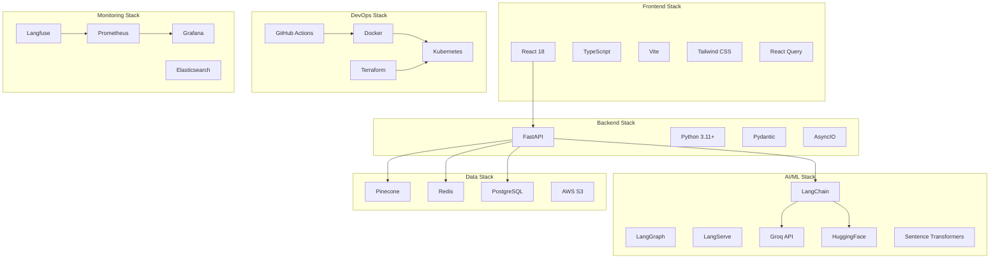
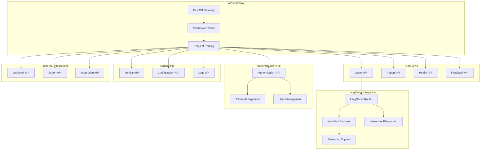

# 🏗️ Smart Medical Literature Assistant - Architecture Diagrams

## System Architecture Overview



## Data Flow Architecture



## Component Interaction Diagram

```mermaid
graph LR
    subgraph "Frontend Components"
        QF[QueryForm]
        PS[ProgressStream]
        RV[ReportViewer]
        EX[ExportTools]
    end
    
    subgraph "API Endpoints"
        QE[/api/query]
        RE[/api/report]
        HE[/health]
        FE[/feedback]
    end
    
    subgraph "LangGraph Nodes"
        PN[Planner Node]
        FN[Fetch Nodes]
        NN[Normalize Node]
        DN[Dedupe Node]
        EN[Embed Node]
        RN[Retrieve Node]
        SN[Synthesize Node]
        CN[Cite Check Node]
        PRN[Persist Node]
    end
    
    subgraph "Service Layer"
        AC[arXiv Client]
        PC[PubMed Client]
        CC[ClinicalTrials Client]
        ES[Embedding Service]
        LS[LLM Service]
        VS[Vector Service]
        RS[Report Service]
    end
    
    subgraph "Data Layer"
        VDB[(Vector Database)]
        FS[(File System)]
        CH[(Cache)]
    end
    
    %% Frontend to API
    QF --> QE
    PS --> QE
    RV --> RE
    EX --> RE
    
    %% API to LangGraph
    QE --> PN
    RE --> PRN
    
    %% LangGraph Flow
    PN --> FN
    FN --> NN
    NN --> DN
    DN --> EN
    EN --> RN
    RN --> SN
    SN --> CN
    CN --> PRN
    
    %% Nodes to Services
    FN --> AC
    FN --> PC
    FN --> CC
    EN --> ES
    RN --> VS
    SN --> LS
    PRN --> RS
    
    %% Services to Data
    ES --> VDB
    VS --> VDB
    RS --> FS
    AC --> CH
    PC --> CH
    CC --> CH
```

## Deployment Architecture



## Security Architecture



## Monitoring & Observability Architecture

```mermaid
graph TB
    subgraph "Application Layer"
        APP[Application Code]
        MIDDLEWARE[Monitoring Middleware]
    end
    
    subgraph "Metrics Collection"
        PROMETHEUS[Prometheus Server]
        NODE_EXPORTER[Node Exporter]
        APP_METRICS[Application Metrics]
        CUSTOM_METRICS[Custom Metrics]
    end
    
    subgraph "Logging Pipeline"
        FLUENTD[Fluentd/Fluent Bit]
        ELASTICSEARCH[Elasticsearch]
        KIBANA[Kibana Dashboard]
    end
    
    subgraph "Tracing System"
        LANGFUSE_TRACE[Langfuse Tracing]
        JAEGER[Jaeger (Optional)]
        TRACE_COLLECTOR[Trace Collector]
    end
    
    subgraph "Alerting System"
        ALERTMANAGER[Alert Manager]
        SLACK[Slack Notifications]
        EMAIL[Email Alerts]
        PAGERDUTY[PagerDuty]
    end
    
    subgraph "Visualization"
        GRAFANA_VIZ[Grafana Dashboards]
        LANGFUSE_UI[Langfuse UI]
        CUSTOM_DASH[Custom Dashboards]
    end
    
    subgraph "Health Checks"
        HEALTH_ENDPOINT[/health Endpoint]
        READINESS[Readiness Probes]
        LIVENESS[Liveness Probes]
    end
    
    %% Data Flow
    APP --> MIDDLEWARE
    MIDDLEWARE --> APP_METRICS
    APP_METRICS --> PROMETHEUS
    
    APP --> FLUENTD
    FLUENTD --> ELASTICSEARCH
    ELASTICSEARCH --> KIBANA
    
    APP --> LANGFUSE_TRACE
    LANGFUSE_TRACE --> TRACE_COLLECTOR
    
    PROMETHEUS --> ALERTMANAGER
    ALERTMANAGER --> SLACK
    ALERTMANAGER --> EMAIL
    ALERTMANAGER --> PAGERDUTY
    
    PROMETHEUS --> GRAFANA_VIZ
    LANGFUSE_TRACE --> LANGFUSE_UI
    
    APP --> HEALTH_ENDPOINT
    HEALTH_ENDPOINT --> READINESS
    HEALTH_ENDPOINT --> LIVENESS
```

## Data Processing Pipeline

```mermaid
graph LR
    subgraph "Input Stage"
        QUERY[User Query]
        FILTERS[Search Filters]
    end
    
    subgraph "Planning Stage"
        PARSE[Query Parser]
        STRATEGY[Search Strategy]
        PARALLEL[Parallel Planner]
    end
    
    subgraph "Collection Stage"
        ARXIV_FETCH[arXiv Fetcher]
        PUBMED_FETCH[PubMed Fetcher]
        CTGOV_FETCH[CT.gov Fetcher]
    end
    
    subgraph "Processing Stage"
        NORMALIZE[Data Normalizer]
        DEDUPE[Deduplicator]
        RANK[Ranking Algorithm]
    end
    
    subgraph "Embedding Stage"
        CHUNK[Text Chunker]
        EMBED_GEN[Embedding Generator]
        VECTOR_STORE[Vector Storage]
    end
    
    subgraph "Retrieval Stage"
        QUERY_EMBED[Query Embedding]
        SIMILARITY[Similarity Search]
        RERANK[Re-ranking]
    end
    
    subgraph "Analysis Stage"
        CONTEXT[Context Assembly]
        LLM_CALL[LLM Generation]
        POST_PROCESS[Post Processing]
    end
    
    subgraph "Output Stage"
        CITE_CHECK[Citation Check]
        FORMAT[Report Formatting]
        EXPORT[Export Generation]
    end
    
    %% Pipeline Flow
    QUERY --> PARSE
    FILTERS --> PARSE
    PARSE --> STRATEGY
    STRATEGY --> PARALLEL
    
    PARALLEL --> ARXIV_FETCH
    PARALLEL --> PUBMED_FETCH
    PARALLEL --> CTGOV_FETCH
    
    ARXIV_FETCH --> NORMALIZE
    PUBMED_FETCH --> NORMALIZE
    CTGOV_FETCH --> NORMALIZE
    
    NORMALIZE --> DEDUPE
    DEDUPE --> RANK
    
    RANK --> CHUNK
    CHUNK --> EMBED_GEN
    EMBED_GEN --> VECTOR_STORE
    
    QUERY --> QUERY_EMBED
    QUERY_EMBED --> SIMILARITY
    VECTOR_STORE --> SIMILARITY
    SIMILARITY --> RERANK
    
    RERANK --> CONTEXT
    CONTEXT --> LLM_CALL
    LLM_CALL --> POST_PROCESS
    
    POST_PROCESS --> CITE_CHECK
    CITE_CHECK --> FORMAT
    FORMAT --> EXPORT
```



## Technology Stack Diagram



## API Architecture



---

## Architecture Decision Records (ADRs)

### ADR-001: Choice of LangGraph for Workflow Orchestration

**Status**: Accepted

**Context**: Need for robust workflow orchestration with state management, error handling, and observability.

**Decision**: Use LangGraph as the primary workflow engine.

**Consequences**:
- ✅ Built-in state management
- ✅ Native LangChain integration
- ✅ Excellent observability
- ❌ Learning curve for team
- ❌ Relatively new technology

### ADR-002: Pinecone for Vector Database

**Status**: Accepted

**Context**: Need for high-performance vector similarity search with minimal operational overhead.

**Decision**: Use Pinecone as the managed vector database solution.

**Consequences**:
- ✅ Managed service (no ops overhead)
- ✅ Excellent performance
- ✅ Good SDK and documentation
- ❌ Vendor lock-in
- ❌ Cost at scale

### ADR-003: React + TypeScript for Frontend

**Status**: Accepted

**Context**: Need for modern, maintainable frontend with good developer experience.

**Decision**: Use React 18 with TypeScript and Vite.

**Consequences**:
- ✅ Strong ecosystem
- ✅ Type safety
- ✅ Fast development
- ✅ Good performance
- ❌ Bundle size considerations

---

This architecture documentation provides a comprehensive view of the Smart Medical Literature Assistant system design, covering all major components, their interactions, and the rationale behind key technology choices.